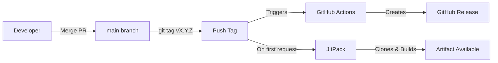

# ADR 002: JitPack for Artifact Publishing

**Status:** Accepted
**Date:** 2026-01-10
**Deciders:** Platform Engineering Team

## Context

We need to publish Gradle plugins and libraries so that consumer projects can depend on them. The solution must:
- Work for both Gradle plugins (`gradle-plugins` repo) and libraries (`spring-commons` repo)
- Be free for public repositories
- Not require consumers to authenticate
- Be simple to set up and maintain

Previously, we used `publishToMavenLocal` for local development, but this doesn't work for sharing artifacts across projects or CI environments.

## Decision Drivers

- Need consistent publishing solution across all repositories
- Must be free (no paid tiers required)
- Consumers should not need authentication to fetch artifacts
- Minimal configuration and maintenance overhead
- Support for semantic versioning via Git tags

## Considered Options

1. **Gradle Plugin Portal** - Official Gradle plugin registry
2. **Maven Central (Sonatype OSSRH)** - Industry standard public repository
3. **JitPack** - Git-based on-demand artifact publishing
4. **GitHub Packages** - GitHub's built-in package registry

## Decision

We chose **JitPack** for publishing all artifacts.

### Positive Consequences

- **Zero cost** - Free for public repositories
- **No authentication for consumers** - Anyone can fetch artifacts
- **Consistent across repo types** - Works for both plugins and libraries
- **Git-native versioning** - Versions come from Git tags
- **On-demand builds** - Only builds when someone requests the artifact
- **No external account required** - Uses GitHub directly
- **Simple setup** - Just add `jitpack.yml` and tag releases

### Negative Consequences

- **First-request latency** - Initial fetch triggers build (~1-2 min wait)
- **Less discoverable** - Not searchable like Maven Central
- **Non-standard coordinates** - Uses `com.github.USERNAME` format
- **Build depends on JitPack availability** - External service dependency

## Implementation Details

### Artifact Coordinates

JitPack uses GitHub username as the group:

| Repository | Artifact Coordinates |
|------------|---------------------|
| gradle-plugins | `com.github.bala-elangovan.gradle-plugins:plugins-java-conventions:TAG` |
| gradle-plugins | `com.github.bala-elangovan.gradle-plugins:plugins-spring-conventions:TAG` |
| spring-commons | `com.github.bala-elangovan.spring-commons:MODULE_NAME:TAG` |

### JitPack Configuration

```yaml
# jitpack.yml
jdk:
  - openjdk21

install:
  - ./gradlew publishToMavenLocal -x test
```

### Build Configuration

```kotlin
// build.gradle.kts
group = "com.github.bala-elangovan"
version = "${property("major")}.${property("minor")}.${property("patch")}"
```

```properties
# gradle.properties
major=0
minor=1
patch=0
```

### Consumer Configuration

```kotlin
// settings.gradle.kts
dependencyResolutionManagement {
    repositoriesMode.set(RepositoriesMode.FAIL_ON_PROJECT_REPOS)
    repositories {
        mavenCentral()
        maven("https://jitpack.io")
    }
}

// build.gradle.kts
dependencies {
    implementation("com.github.bala-elangovan:spring-commons:v0.1.0")
}
```

### Release Workflow



## Alternatives Considered

### Option 1: Gradle Plugin Portal

- **Pros**: Official registry for Gradle plugins, discoverable, trusted
- **Cons**: Only works for Gradle plugins (not libraries), requires separate Gradle Portal account, more complex publishing setup
- **Rejection Reason**: Cannot use for `spring-commons` library, inconsistent across repositories

### Option 2: Maven Central (Sonatype OSSRH)

- **Pros**: Industry standard, highly discoverable, trusted by enterprises
- **Cons**: Complex setup (GPG signing, Sonatype account, domain verification), takes days to get approved, steep learning curve
- **Rejection Reason**: Excessive complexity for our current needs; can migrate later if needed

### Option 3: GitHub Packages

- **Pros**: Integrated with GitHub, free for public repos
- **Cons**: **Consumers must authenticate** even for public packages, requires GitHub token setup
- **Rejection Reason**: Authentication requirement defeats the purpose of easy consumption

## Comparison Matrix

| Criteria | Gradle Portal | Maven Central | JitPack | GitHub Packages |
|----------|---------------|---------------|---------|-----------------|
| Free | Yes | Yes | Yes | Yes |
| Consumer Auth | No | No | No | **Yes** |
| Plugins Support | Yes | Yes | Yes | Yes |
| Libraries Support | **No** | Yes | Yes | Yes |
| Setup Complexity | Medium | **High** | Low | Medium |
| Discoverability | High | High | Low | Low |
| Build on Demand | No | No | Yes | No |
| Consistent Coords | No | Yes | Yes | Yes |

## Validation

We validated this decision by:
1. Successfully publishing `gradle-plugins` v0.1.0 to JitPack
2. Verifying artifact can be fetched without authentication
3. Testing consumer project dependency resolution
4. Measuring first-request build time (~90 seconds)

## Migration Path

If we outgrow JitPack in the future:

1. **To Maven Central**: Add GPG signing, Sonatype account, update coordinates
2. **To Gradle Portal**: For plugins only, register and configure publishing
3. **Consumer Impact**: Would require updating dependency coordinates

## Workflow Integration

### CI/CD Pipeline

```yaml
# .github/workflows/release.yml
on:
  push:
    tags: ['v*']

jobs:
  release:
    steps:
      - uses: actions/checkout@v4
      - name: Validate build
        run: ./gradlew build
      - name: Create GitHub Release
        uses: softprops/action-gh-release@v2
        with:
          generate_release_notes: true
```

### Versioning Strategy

We use semantic versioning with components in `gradle.properties`:

```properties
major=0  # Breaking changes (0 = initial development)
minor=1  # New features, backward compatible
patch=0  # Bug fixes
```

Version `0.x.x` indicates initial development phase. We will release `1.0.0` when the API is considered stable.

## References

- [JitPack Documentation](https://docs.jitpack.io/)
- [JitPack for Gradle](https://docs.jitpack.io/building/#gradle-projects)
- [Semantic Versioning](https://semver.org/)
- [GitHub Actions](https://docs.github.com/en/actions)

## Notes

This decision prioritizes simplicity and consistency across repositories. JitPack's on-demand build model means we don't pay for artifacts that are never used, and consumers get a straightforward dependency experience without authentication hurdles.
