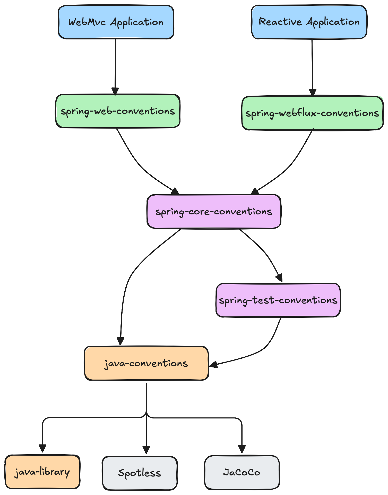
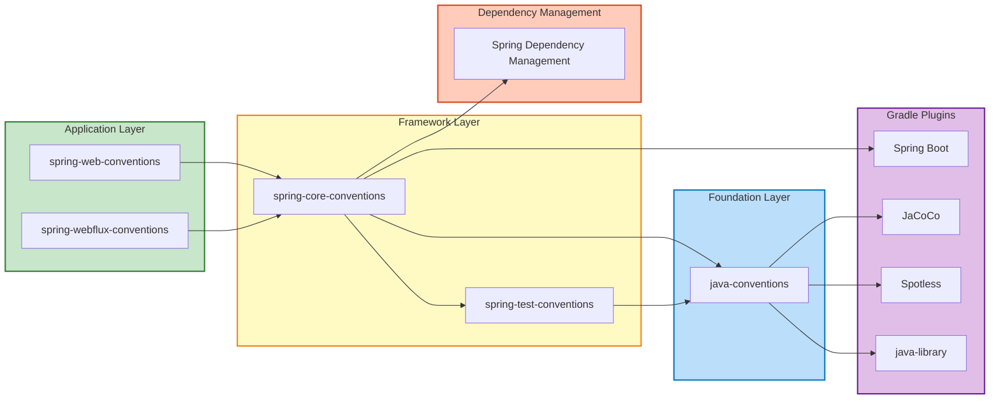
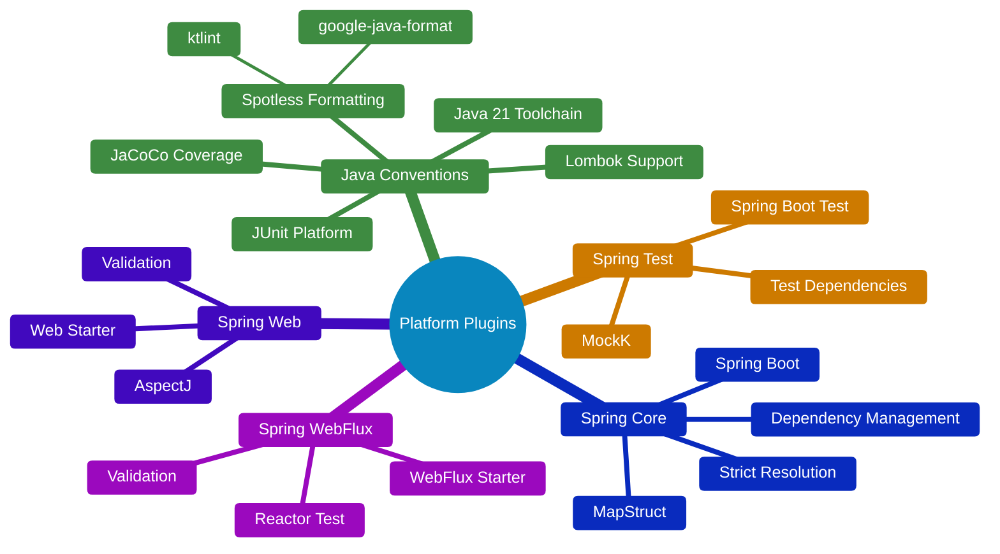
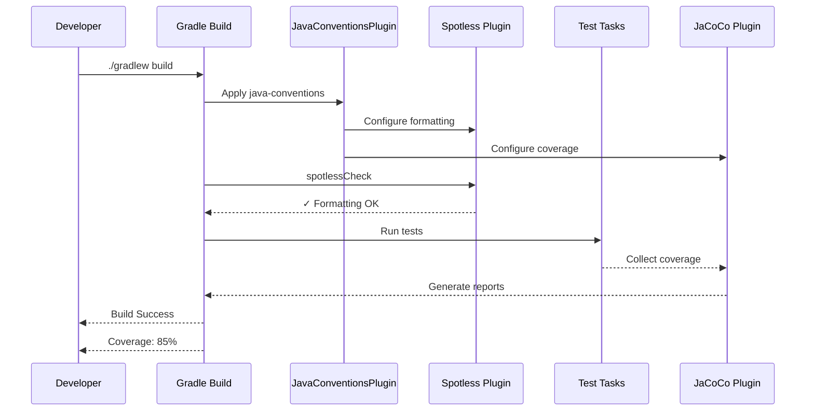
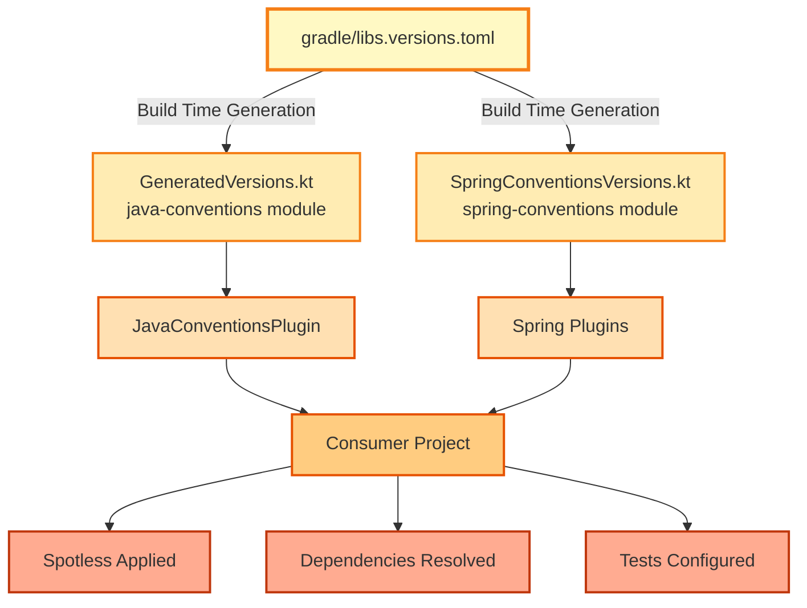
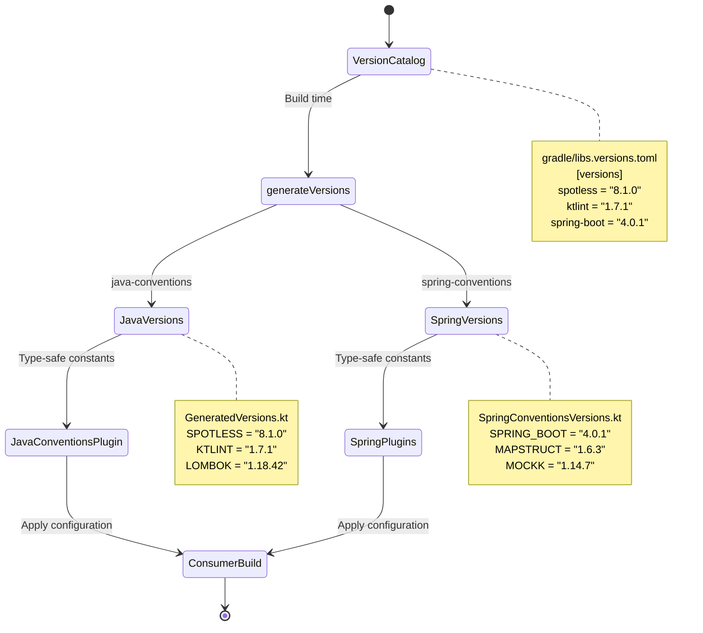

# Plugin Composition Architecture

This document visualizes how our Gradle convention plugins compose together to provide layered functionality.

## Plugin Dependency Graph



## Detailed Plugin Stack



## Plugin Responsibilities



## Build Lifecycle Flow



## Configuration Propagation



## Version Management Flow



## Module Structure

The plugin modules are organized in a nested monorepo structure:

```
gradle-plugins/
├── plugins/
│   ├── java-conventions/          # Base Java/Kotlin conventions
│   │   ├── src/main/kotlin/
│   │   │   └── io/github/balaelangovan/gradle/
│   │   │       ├── JavaConventionsPlugin.kt
│   │   │       └── GeneratedVersions.kt (auto-generated)
│   │   └── build.gradle.kts
│   └── spring-conventions/        # Spring Boot conventions
│       ├── src/main/kotlin/
│       │   └── io/github/balaelangovan/gradle/spring/
│       │       ├── SpringTestConventionsPlugin.kt
│       │       ├── SpringCoreConventionsPlugin.kt
│       │       ├── SpringWebConventionsPlugin.kt
│       │       ├── SpringWebFluxConventionsPlugin.kt
│       │       └── SpringConventionsVersions.kt (auto-generated)
│       └── build.gradle.kts
├── gradle/
│   └── libs.versions.toml         # Version catalog (single source of truth)
└── build.gradle.kts                # Root build with publishAllToMavenLocal task
```

**Key architectural decisions:**
- **Module independence**: Each module generates its own version constants file
- **No cross-module dependencies**: spring-conventions doesn't depend on java-conventions at build time
- **Runtime composition**: Spring plugins apply java-conventions via plugin application, not module dependency
- **Nested structure**: All plugin modules grouped under `plugins/` directory

## Key Design Principles

### 1. Layered Composition
Plugins build on each other incrementally:
- **Base Layer**: Java tooling (java-conventions)
- **Framework Layer**: Spring Boot (spring-core-conventions)
- **Application Layer**: Web/WebFlux (specific implementations)

### 2. Single Responsibility
Each plugin has a focused purpose:
- `java-conventions`: Code quality + toolchain
- `spring-test-conventions`: Testing only
- `spring-core-conventions`: Spring Boot integration
- `spring-web-conventions`: Web-specific dependencies

### 3. Module Independence
Version files are module-specific:
- `java-conventions` generates `GeneratedVersions.kt` (Lombok, Spotless, JaCoCo, etc.)
- `spring-conventions` generates `SpringConventionsVersions.kt` (Spring Boot, MapStruct, test libs, etc.)
- No build-time dependencies between modules
- Plugins compose at runtime via plugin application

### 4. Convention Over Configuration
Sensible defaults with escape hatches:
- Pre-configured but customizable
- Centralized version management via Gradle Version Catalog
- Standard repository configuration

### 5. Fail-Fast Philosophy
Catch issues early:
- Spotless fails build on formatting issues
- Strict dependency resolution fails on conflicts
- JaCoCo generates reports automatically
